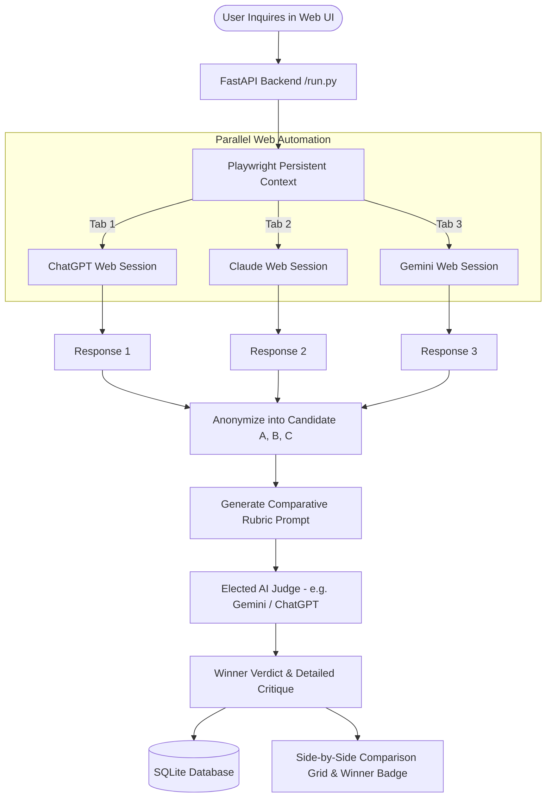

# ⚡ BestResponse - Multi-LLM Web Orchestrator & AI Judge

> **No API Keys Required.** Connect your personal web accounts on **ChatGPT**, **Claude**, **Gemini**, and **GLM (chat.z.ai)** to query them simultaneously, compare results side-by-side, and let an impartial **AI Judge** choose the best answer.

---

## 🌟 Key Features

- **No API Keys or Pay-Per-Token Bills**: Automates official web chat interfaces (`chatgpt.com`, `claude.ai`, `gemini.google.com`, `chat.z.ai`) using your existing personal or subscription accounts (Google, Apple, email/password, 2FA).
- **Persistent Session Storage**: Log in once via the built-in Login Manager; session cookies and tokens remain permanently saved on your machine in `./browser_profile`.
- **Concurrent Dispatch**: Sends your prompt to ChatGPT, Claude, Gemini, and GLM in parallel tabs, cutting wait times by up to 70%.
- **Impartial AI Peer Review Judge**: Automatically anonymizes candidate answers as *Candidate A*, *Candidate B*, *Candidate C*, and *Candidate D*, and routes them to an elected AI Judge (Gemini, ChatGPT, Claude, or GLM) with a strict 4-criteria rubric:
  1. *Accuracy & Correctness* (0-10)
  2. *Completeness & Depth* (0-10)
  3. *Clarity, Structure & Code Quality* (0-10)
  4. *Practical Relevance & Directness* (0-10)
- **Quantitative & Heuristic Metrics**: Measures response word counts, character counts, code blocks, reading time, and structural density scores.
- **Glassmorphism Web Dashboard**: Modern dark-mode interface with live WebSocket status streaming, syntax-highlighted code blocks, collapsible AI evaluation breakdowns, and one-click copy.
- **Local SQLite History**: All past inquiries, model responses, metrics, and judge verdicts are safely stored in a local SQLite database (`./data/bestresponse.db`).

---

## 🚀 Quick Start Guide

### Option 1: One-Click Launch

- **Windows**: Double-click `start.bat`. It will automatically set up `.venv`, install requirements, download Chromium, and launch the dashboard.
- **Linux / macOS**: Run `./start.sh` (or `bash start.sh`).

### Option 2: Manual Installation & Run

1. **Clone the repository**:
   ```bash
   git clone <your-repo-url>
   cd "LLM Web Arena"
   ```

2. **Create and activate a virtual environment**:
   - **Windows (PowerShell)**:
     ```powershell
     python -m venv .venv
     .\.venv\Scripts\Activate.ps1
     ```
   - **Linux / macOS**:
     ```bash
     python3 -m venv .venv
     source .venv/bin/activate
     ```

3. **Install dependencies and Playwright browser**:
   ```bash
   pip install -r requirements.txt
   playwright install chromium
   ```

4. **Launch the dashboard**:
   ```bash
   python run.py
   ```
   The dashboard will automatically open at: **http://127.0.0.1:8000**

---

## 🔑 How to Log In (One-Time Setup)

Because web chat portals use authentication and Cloudflare/bot checks, BestResponse provides an interactive login manager:

1. Open the dashboard at `http://127.0.0.1:8000` and click the **"Manage Web Logins"** button at the top right (or run `python run.py --login`).
2. A clean Chromium browser window will open with tabs for:
   - **ChatGPT** (`https://chatgpt.com/`)
   - **Claude** (`https://claude.ai/new`)
   - **Gemini** (`https://gemini.google.com/app`)
   - **GLM** (`https://chat.z.ai/`)
3. Log in to your personal accounts in that browser window as you normally do (Google Sign-In, Apple, Email, 2FA, Authenticator).
4. Click **"Done & Save Session"** in the dashboard modal (or close the login browser).
5. All session cookies are preserved locally in `./browser_profile/`. You are now ready to run queries!

> **Note**: You do not have to be logged into all 4 models. BestResponse will automatically detect which accounts are active and query only your available models.

---

## 📖 How It Works



---

## 🛠️ Project Structure

```
BestResponse/
├── app/
│   ├── __init__.py
│   ├── config.py             # Settings, timeouts, directory paths
│   ├── database.py           # SQLite storage for battles & metrics
│   ├── browser_manager.py    # Playwright lifecycle & persistent profile manager
│   ├── providers/
│   │   ├── __init__.py
│   │   ├── base.py           # BaseProvider class & streaming stabilization
│   │   ├── chatgpt.py        # ChatGPT web automation & DOM extractor
│   │   ├── claude.py         # Claude web automation & DOM extractor
│   │   ├── gemini.py         # Gemini web automation & DOM extractor
│   │   └── glm.py            # GLM (chat.z.ai) web automation & DOM extractor
│   ├── evaluator.py          # AI Judge prompt builder, verdict parser & heuristics
│   ├── server.py             # FastAPI REST & WebSocket streaming server
│   └── static/
│       ├── index.html        # Modern responsive dashboard
│       ├── css/style.css     # Glassmorphism dark-theme styling
│       └── js/app.js         # Frontend WebSocket logic & markdown rendering
├── browser_profile/          # Local persistent Chromium directory (stores login state, gitignored)
├── data/                     # SQLite database storage (bestresponse.db, gitignored)
├── tests/
│   ├── test_core.py          # Database & evaluator unit tests
│   ├── test_api.py           # FastAPI REST endpoint integration tests
│   └── test_websocket.py     # WebSocket validation & streaming tests
├── run.py                    # Main CLI entrypoint
├── start.bat                 # Windows one-click launcher
├── start.sh                  # Linux/macOS bash launcher
├── requirements.txt          # Python package dependencies
├── LICENSE                   # MIT License
└── README.md                 # Documentation
```

---

## 🧪 Running Tests

To verify that the database, evaluation parser, and server APIs are functioning properly:

```powershell
.\.venv\Scripts\python.exe -m unittest discover -s tests
```

Or on Linux/macOS:

```bash
python3 -m unittest discover -s tests
```

---

## 📄 License

This project is open-source and distributed under the [MIT License](file:///w:/Project/LLM%20Web%20Arena/LICENSE).

